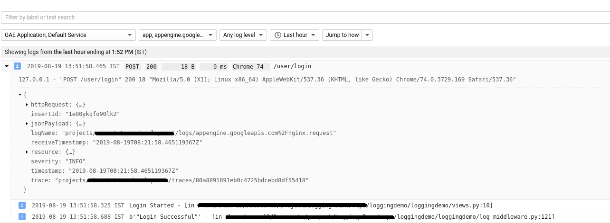

Google Stackdriver Nested Logging With GAE Flexible Environment
===========
In GAE flexible environment the all logs are stores separately, so it is very difficult to monitor the unstructured request logs. Here is the application written in django, contains the code for override the logging middleware of django and store the logs in nested structure.

-----------

Before implementation it looks like this:


After implementation logs will show in parent child relation:



Setup
===========

```
Add service account json file with name 'service-account-logging.json' at root level.
```
```
Add the requirements defined in requirements.txt.
```
```
Run the application.
```
